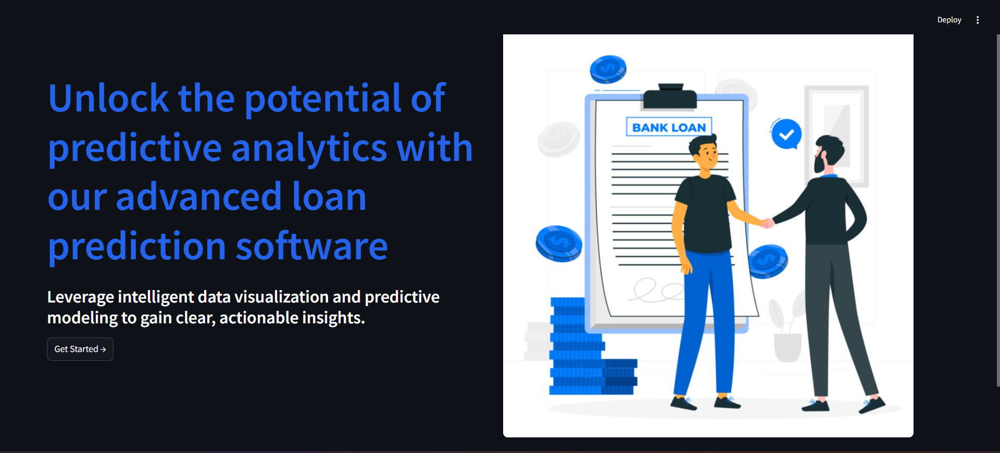
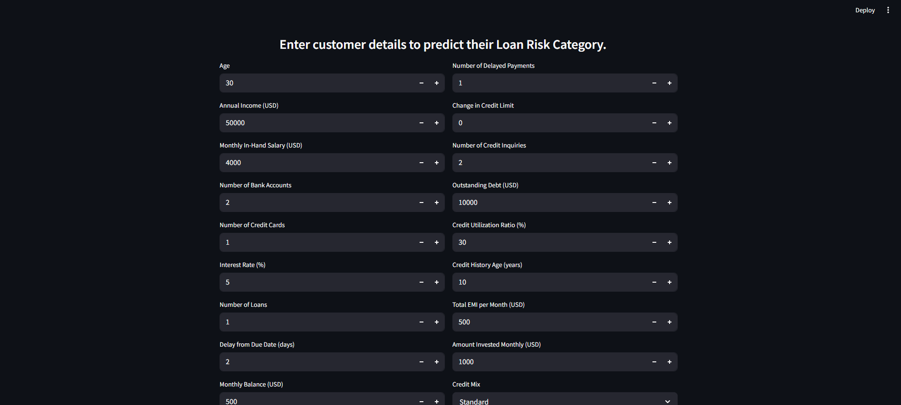
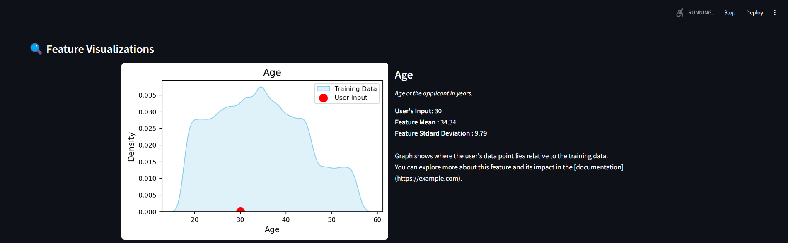
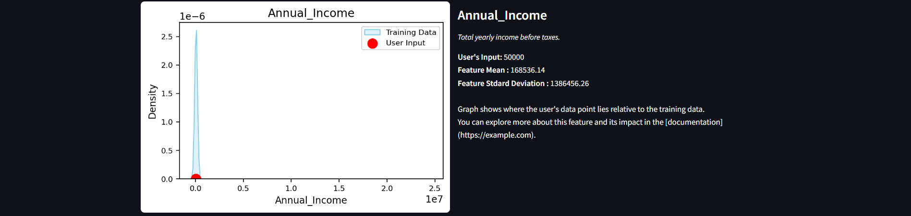
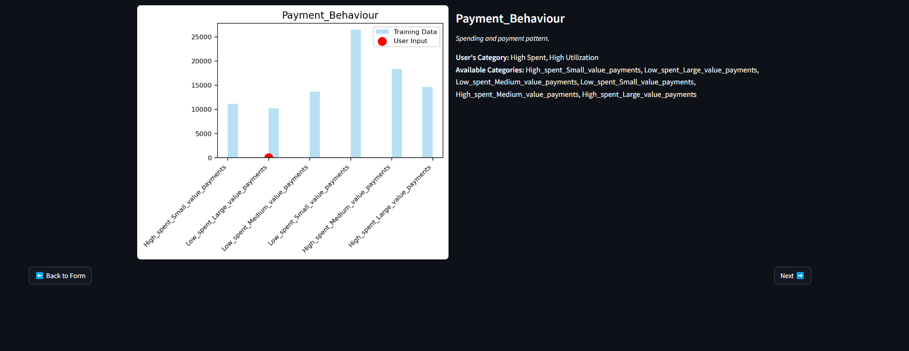
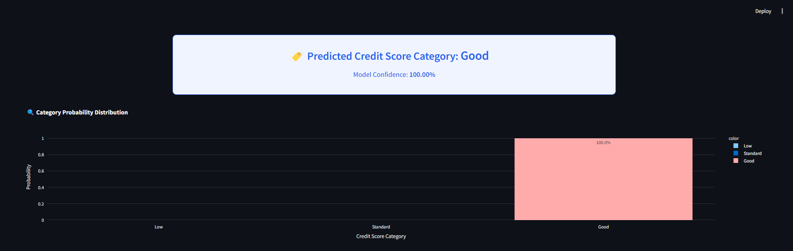
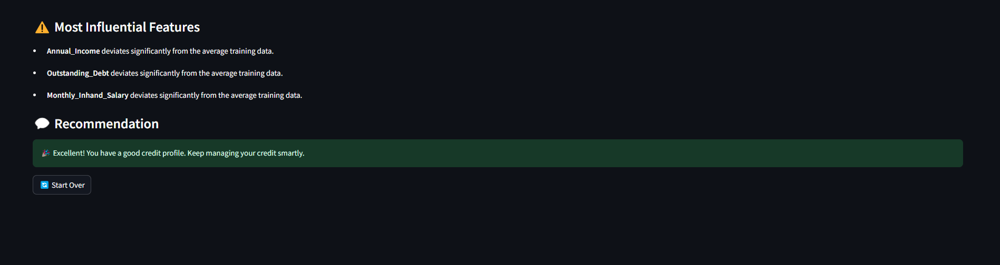

# 🏦 Loan Risk Prediction

This project uses machine learning to predict whether a user poses a **high** or **low risk** for loan default based on their transaction behavior. It leverages transaction data such as withdrawals, deposits, balances, and more to make informed risk assessments.

---

## 📂 Dataset

The dataset contains **116,202 financial records**.

## 🛠️ Features Engineered

- Monthly Average Balance  
- Net Monthly Cash Flow  
- Transaction Frequency  
- Withdrawal/Deposit Ratios  
- Maximum and Minimum Balances  
- Spend vs. Income Patterns

---

## 🤖 Model Training

Several models were trained and evaluated:
- Logistic Regression  
- Random Forest  
- Decision Tree  
- Artificial Neural Network (Keras)

The **ANN model** gave the best performance and was deployed with the frontend.

---

## 📸 Demo

A simple and interactive **Streamlit** frontend where users can upload transaction history and receive instant risk predictions.

Customer Details Form

Feature Visualization

Final Prediction

---
